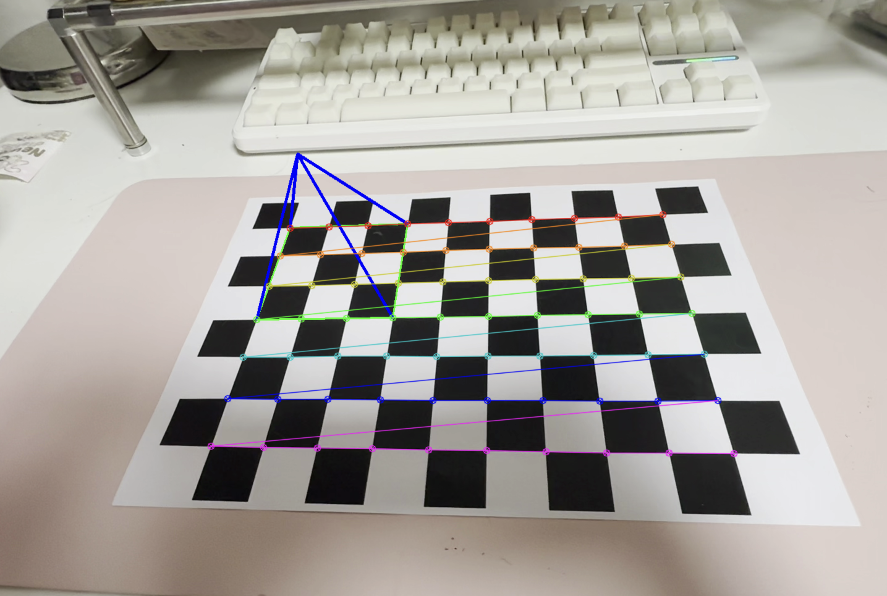
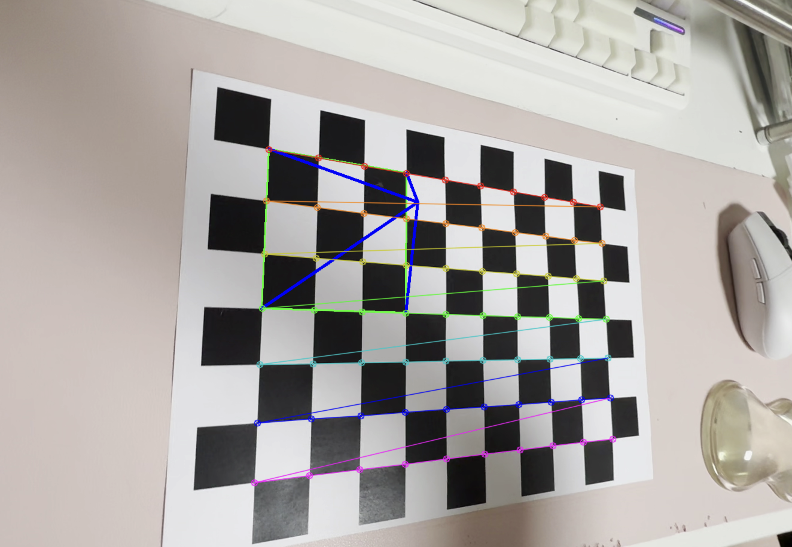
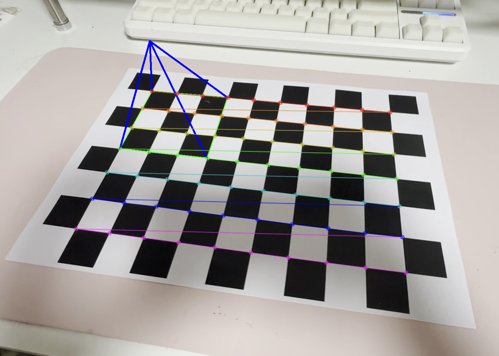

# Camera Pose AR Pyramid

체스보드 패턴을 이용해 카메라 자세를 추정하고, 영상 위에 3D AR 물체를 시각화하는 OpenCV 프로젝트다.

## Overview

이 프로젝트는 카메라 캘리브레이션 결과를 사용해 체스보드의 코너를 검출하고, 카메라의 pose를 추정한 뒤 3D 피라미드 객체를 영상 위에 투영한다.

## Features

- 체스보드 기반 camera pose estimation
- OpenCV `solvePnP()`를 이용한 자세 추정
- OpenCV `projectPoints()`를 이용한 3D 객체 투영
- 체스보드 위에 3D pyramid AR object visualization
- 이미지 및 영상 결과 제공

## Project Structure

    camera-pose-ar/
    ├── pose_ar.py
    ├── calibration.npz
    ├── data/
    │   └── chessboard.avi
    ├── result/
    │   ├── result_01.png
    │   ├── result_02.png
    │   ├── result_03.png
    │   └── demo_ar.mp4
    └── README.md

## Requirements

- Python 3
- OpenCV
- NumPy

## Installation

    pip install opencv-python numpy

## How to Run

### 1. Camera calibration result 준비
기존 카메라 캘리브레이션 결과 파일 `calibration.npz`가 프로젝트 폴더에 있어야 한다.

### 2. 프로그램 실행

    python3 pose_ar.py

## Method

1. 체스보드 패턴의 내부 코너를 검출한다.
2. 캘리브레이션 결과를 이용해 카메라 내부 파라미터와 왜곡 계수를 불러온다.
3. `solvePnP()`를 사용해 카메라 pose를 추정한다.
4. `projectPoints()`를 사용해 3D 피라미드 객체를 2D 영상 평면에 투영한다.
5. 최종적으로 체스보드 위에 AR 피라미드를 시각화한다.

## AR Object

이 프로젝트에서는 예제와 다른 AR 물체로 **3D pyramid**를 사용했다.

## Results

### Result Images

#### Result 1

#### Result 2

#### Result 3

### Demo Video

[demo_ar.mp4](result/demo_ar.mp4)

## Notes

- 체스보드 패턴이 정확히 검출되어야 pose estimation이 안정적으로 수행된다.
- 캘리브레이션 결과가 정확할수록 AR 객체가 더 자연스럽게 정렬된다.

## 추가 실험 (Additional Experiment)

체스보드 위에 단순한 도형 대신, 투명 배경의 캐릭터 이미지를 활용하여 AR 객체를 시각화하는 실험을 진행하였다.

GIF 이미지의 배경을 제거하기 위해 Python 코드(Pillow, NumPy)를 이용하여 투명 배경 처리를 수행한 후, 해당 이미지를 체스보드 위에 배치하였다.

3D 모델은 아니지만, 카메라 pose estimation 결과를 이용해 체스보드 위 특정 위치에 캐릭터가 서 있는 것처럼 보이도록 구현하였다.

## Description

AR object visualization using camera pose estimation with OpenCV.
